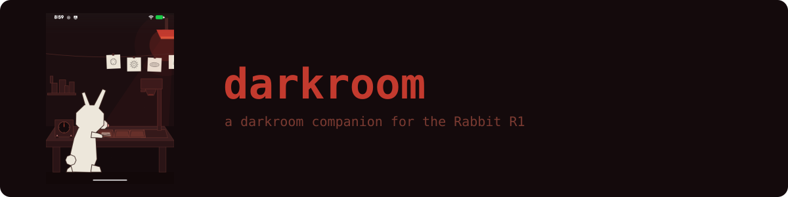
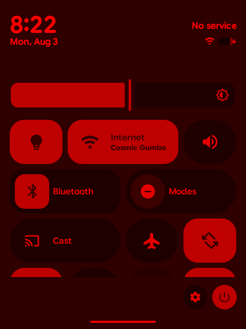
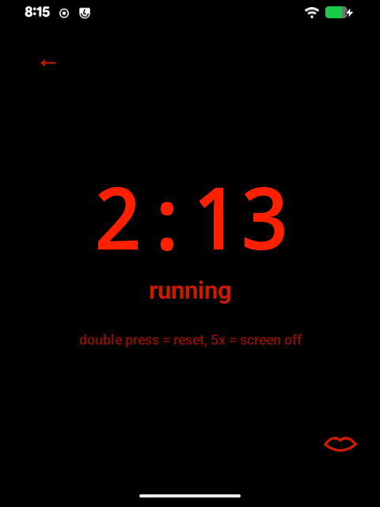
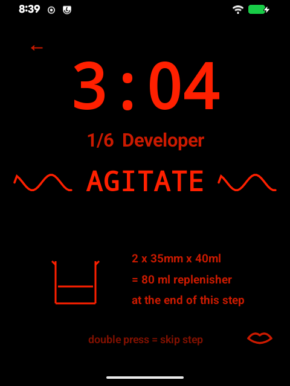
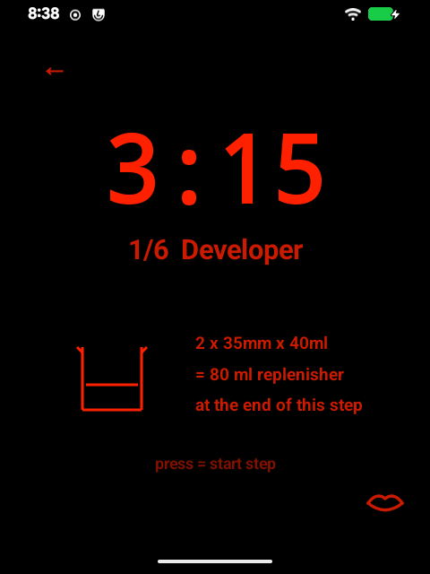
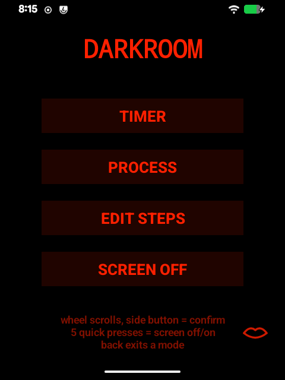
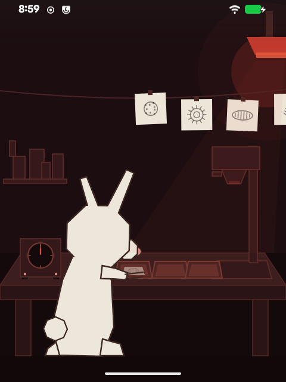

<p align="center"></p>

# darkroom

Darkroom companion for a **rooted Rabbit R1 running LineageOS** (flashed with
[tap-root](../../../tap-root)).

# Features

<table>
<tr>
<td width="260"></td>
<td>

## Safelight

Quickstart tile that turns off the green and blue channels, and caps max brightness. This is currently untested, make sure that you perform a fog test before relying on this for B&W printing. Obviously unsafe for panchromatic printing.</td>
</tr>
<tr>
<td width="260"></td>
<td>

## Timer
Fully integrated with the rabbit R1 hardware (as long as you have flashed with tap-root)

## Features
- Turn R1 scroll wheel to set seconds and minutes
- Use side button to confirm, or hold side button to speak the time you wish to set
- Continuous voice feedback, toggleable.
- Screen blackout, press the side button 5x quickly at any time to turn off the screen and control the timer completely through hardware and voice prompts.
</td>
</tr>
<tr>
<td width="260"></td>
<td>

## Processes

Pre-program any of your most used processes into this feature: per-step times, agitation schemes, replenishment ml per roll (35mm / 120 / 4x5). Spoken agitate/rest cues on every boundary.</td>
</tr>
<tr>
<td width="260"></td>
<td>

## Replenishment


Process mode also supports any replenishment regimen your chemistry may (or may not) need.</td>
</tr>
<tr>
<td width="260"></td>
<td>

## Eyes-free for panchromatic work

Wheel and button drive every screen. The mouth icon mutes speech for beep codes; long-press it to change the voice.</td>
</tr>
<tr>
<td width="260"></td>
<td>

## And a little buddy?

Comes with a cute little wallpaper. I wonder what happens if you click the timer.</td>
</tr>
</table>

## Install

Grab `darkroom.apk` from the [latest release](../../releases/latest) and
sideload it:

```bash
adb install -r darkroom.apk
```

Open it and the setup screen walks through granting a few permissions for safelight access, microphone, the Quick Settings
tile, and the wallpaper. It appears on its own until the required ones are
granted, and can be accessed again from the gear icon.

A stock C-41 process ships with the app so there is something to run on day
one; edit it, rename it, or delete it like any process you define yourself.

> Requires the tap-root image: the safelight uses LineageOS's LiveDisplay,
> and the side button only reaches apps because tap-root remaps it from
> POWER to F1 in the system keylayout. On anything else you get a touch-only
> timer.

## Controls

| Input | Timer | Process | Menus |
|---|---|---|---|
| Wheel | set time | film counts | select |
| Button | confirm / start | start step | activate |
| Double press | reset | skip step | — |
| Five presses | blackout | blackout | blackout |
| Hold | speak a duration | — | — |

## Build

```bash
docker build --platform linux/amd64 -t r1-android-build .
docker run --rm --platform linux/amd64 -v "$PWD":/app -w /app r1-android-build ./build.sh
```

No Gradle — `build.sh` drives aapt2/javac/d8 directly. CI builds the APK on
every push and attaches it to releases on tags.
